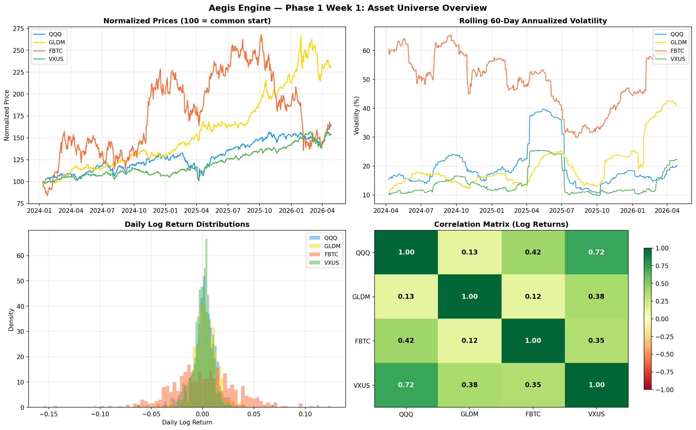
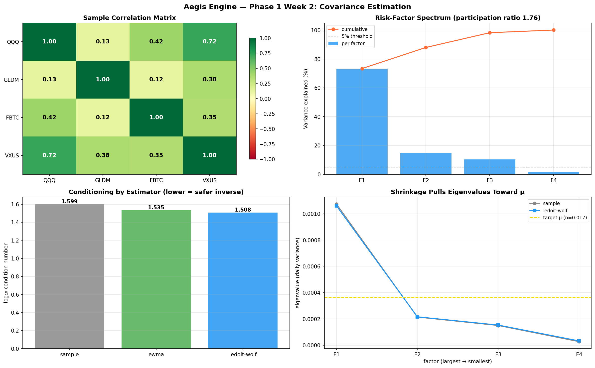
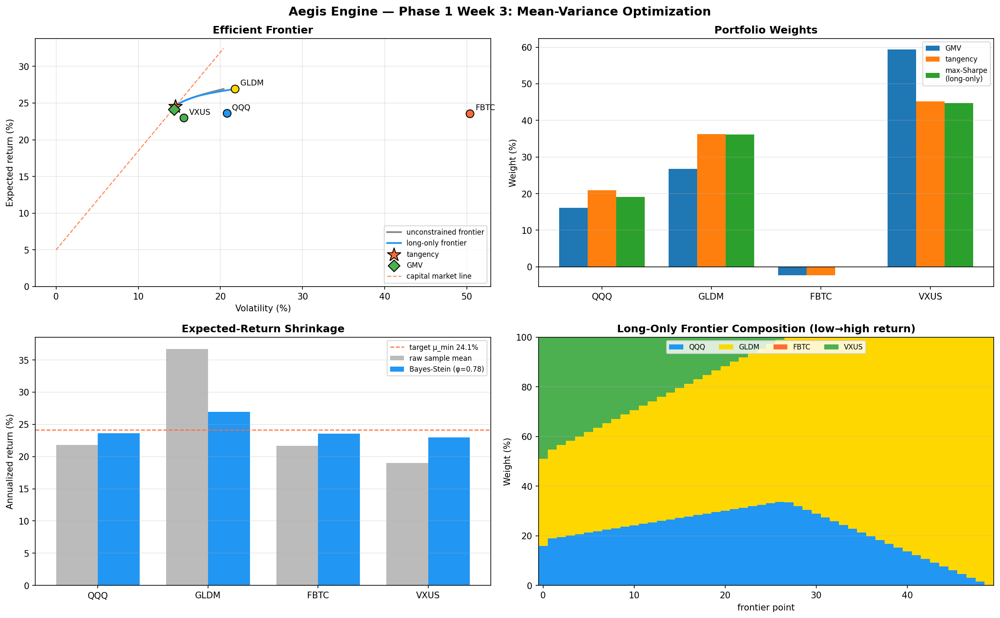
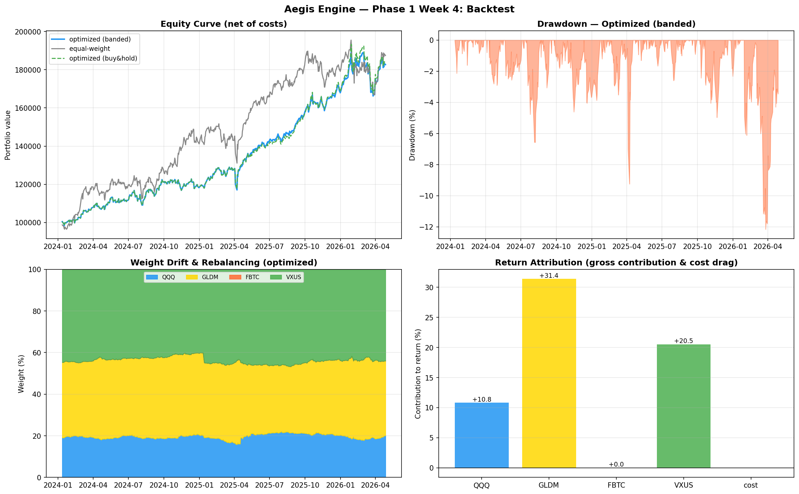
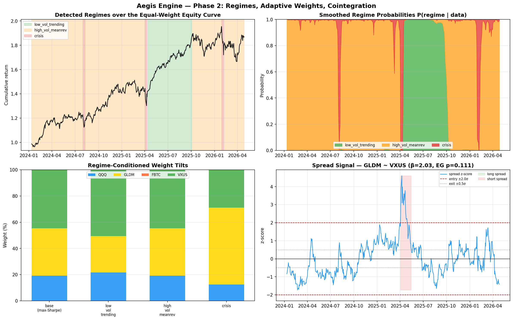

# Aegis Engine

A distributed quantitative execution system for multi-asset portfolio management with macro regime awareness and tactical position scaling.


*Normalized prices, return distributions, drawdown curves, and rolling vol for the four-asset universe (574-day common period, 2024-01-11 → 2026-04-27).*


*Correlation structure, the risk-factor spectrum (one factor carries 73% of variance), condition number across the three estimators, and Ledoit-Wolf shrinkage pulling eigenvalues toward the target μ.*


*The efficient frontier (unconstrained + long-only) with the capital market line, key-portfolio weights, Bayes-Stein shrinkage of the mean vector, and the long-only frontier's changing composition. Shrinkage turns a 69%-gold overfit into a diversified portfolio.*


*Net-of-cost equity curves (optimized vs equal-weight vs buy-and-hold), drawdown, weight drift under ±5% rebalancing bands, and per-asset return attribution with cost drag. The optimizer earns less than equal-weight but at a higher Sharpe (1.56 vs 1.26) and shallower drawdown.*


*A from-scratch Gaussian HMM's detected regimes over the equity curve, its smoothed regime probabilities, the resulting weight tilts, and a cointegration spread signal. Given no event calendar, the model assigned its crisis state to exactly three episodes — the August 2024 yen carry unwind, the April 2025 tariff shock, and January 2026.*

## Architecture

Aegis operates on three layers:

**Macro Regime Layer** — Determines strategic asset allocation based on the current macroeconomic regime (growth/inflation dynamics). Consumes external signals and validates against an internal Hidden Markov Model for regime classification.

**Tactical Math Engine** — Computes optimal portfolio weights using mean-variance optimization with robust covariance estimation. Trades around core positions within regime-defined risk budgets using mean-reversion signals and adaptive rebalancing bands.

**Execution Engine** — Manages order routing, position tracking, and state management. Communicates with the math engine over Redis pub/sub and maintains an audit ledger in PostgreSQL.

## What this project demonstrates

- **Quantitative finance** — covariance estimation (sample, EWMA, Ledoit-Wolf shrinkage), mean-variance optimization, regime modeling with HMMs, transaction-cost-aware backtesting.
- **Software engineering** — distributed messaging over Redis pub/sub, audit ledgers in PostgreSQL, fault-tolerant execution, containerized deployment.
- **Software Design and Testing** — Architecture Decision Records, change retrospectives, contract-based test invariants, type-safe configuration with no magic numbers.

## Engineering practices

This project is built to be auditable by design. Every nontrivial decision and meaningful change is recorded.

- **[Architecture Decision Records](docs/adr/)** — every nontrivial design choice documented with the alternatives considered and tradeoffs accepted. See [ADR-003](docs/adr/003-asset-universe-vxus.md) for an example.
- **[Change retrospectives](docs/retros/)** — debriefs after meaningful changes record what was expected, what actually happened, and what carries forward. See [Retro-001](docs/retros/001-vxus-swap.md) for an example.
- **Contract-based tests** — 20 invariants protecting downstream modules (column order, index alignment, FBTC pre-inception NaN handling, mathematical identities between return calculations). See [ADR-002](docs/adr/002-test-contracts-not-calibration.md) for the testing philosophy.
- **Single source of truth** — every tunable parameter (decay factors, lookback windows, transaction costs, asset universe) lives in `math-engine/config.py`. No magic numbers buried in module logic.

## Roadmap

A five-phase build. Each phase produces something working and demonstrable — no phase depends on completing all prior phases perfectly.

### Phase 1 — Math Engine *(complete)*

*Proves: can handle real financial data and translate textbook math (covariance estimation, Lagrange multipliers, efficient frontier) into production-quality code with proper testing and audit trails.*

- [x] — Data pipeline: fetch via yfinance, clean, log returns, descriptive statistics, correlations
- [x] — Covariance estimation: sample, EWMA (λ=0.94 RiskMetrics), Ledoit-Wolf shrinkage, condition number diagnostics, eigendecomposition
- [x] — Mean-variance optimizer with expected-return shrinkage; efficient frontier construction; constrained optimization (long-only, sector caps)
- [x] — Backtest harness with transaction costs, slippage modeling, rebalancing bands, performance attribution

### Phase 2 — Signal Development *(complete)*

*Proves: understands that markets are non-stationary and can build adaptive systems instead of static optimizers. Distinguishes statistical arbitrage thinking from passive rebalancing.*

- [x] — Hidden Markov Model regime detection, built from scratch (Baum-Welch EM in log space, Viterbi decoding), labeling low-vol trending / high-vol mean-reverting / crisis
- [x] — Adaptive weight engine that responds to regime classifications — risk-on tilts toward equity, risk-off tilts toward gold, with constraint-preserving multiplicative tilts
- [x] — Cointegration testing (Engle-Granger, Johansen) on asset pairs; spread-based signals with entry/exit hysteresis at ±2σ

Two findings worth stating plainly. The HMM, given no event calendar, assigned its crisis state to exactly three episodes — the August 2024 yen carry-trade unwind, the April 2025 tariff shock, and January 2026 — recovering known market stress from the return series alone. And the cointegration layer returns an honest negative: **no pair is cointegrated** here (Johansen rank r=0), which is the correct result for a universe deliberately built so each asset hedges a different failure mode. See [ADR-006](docs/adr/006-hmm-from-scratch-stats-tests-delegated.md) for the build-vs-borrow reasoning.

### Phase 3 — Execution Layer *(planned)*

*Proves: can build a polyglot async system with strong contracts between services, handle real-world execution complexity (partial fills, network failures, idempotency), and reason about audit and reconciliation.*

- Python math engine publishes target weight vectors to Redis (timestamp, confidence, regime, expected turnover)
- Java 21 / Spring Boot execution engine with virtual-thread message handling
- Alpaca paper trading integration with full order state machine (PENDING → SENT → PARTIAL_FILL → FILLED / REJECTED)
- PostgreSQL audit ledger for every order, fill, and portfolio snapshot

### Phase 4 — ML Integration *(planned)*

*Proves: can apply ML to finance without falling into the in-sample overfitting trap. Demonstrates feature-engineering judgment and an honest take on ML's role (augmenting, not replacing, well-grounded baselines).*

- Macro feature engineering: VIX, yield-curve slope (10Y–2Y), DXY, oil, credit spreads
- FinBERT sentiment pipeline on Fed minutes, FOMC statements, and financial news
- Neural regime classifier (LSTM / Transformer) ensembled with the HMM baseline; walk-forward validation throughout
- Local LLM (quantized Mistral / Llama) for structured signal extraction from macro reports — operational edge over per-token cloud inference

### Phase 5 — Production Hardening *(planned)*

*Proves: thinks about what happens when the system runs unsupervised — failure modes, observability, safety rails. The difference between a project and a piece of infrastructure.*

- Docker Compose for the full stack: Python + Java + Redis + Postgres, one command
- Health monitoring dashboard (Grafana / Prometheus): positions, P&L, regime, signal freshness
- Circuit breakers: max-drawdown halt, signal-staleness halt, position-concentration halt
- AWS EC2 deployment of the full stack

## Asset Universe

Four ETFs, each chosen to hedge a different failure mode. See [ADR-003](docs/adr/003-asset-universe-vxus.md) for the rationale behind the current selection.

| Ticker | Name | Role |
|--------|------|------|
| QQQ | Invesco QQQ Trust | Tech beta / equity risk premium / US|
| GLDM | SPDR Gold MiniShares | Inflation / monetary debasement hedge / Defensive |
| FBTC | Fidelity Wise Origin Bitcoin Fund | financial repression hedge |
| VXUS | Vanguard Total International Stock ETF | Ex-US (developed + emerging) diversification |

## Tech Stack

- **Math Engine:** Python 3.12+ (NumPy, SciPy, Pandas, statsmodels, yfinance)
- **ML / NLP:** FinBERT, quantized local LLMs (Mistral / Llama) — *planned*
- **Execution Engine:** Java 21+ (Spring Boot, Virtual Threads), Alpaca API — *planned*
- **Messaging:** Redis pub/sub — *planned*
- **Ledger:** PostgreSQL — *planned*
- **Observability:** Grafana / Prometheus — *planned*
- **Deployment:** Docker Compose → AWS EC2 — *planned*

## Quick Start

```bash
cd math-engine
pip install -r requirements.txt
python main.py                  # data pipeline overview
python -m covariance.report     # covariance estimators + conditioning
python -m optimizer.report      # efficient frontier + optimal weights
python -m backtest.report       # backtest with costs + attribution
python -m signals.report        # regimes, adaptive tilts, cointegration
```

## Running Tests

```bash
cd math-engine
pytest tests/ -v
```

## Repository Layout

```
aegis-engine/
├── math-engine/             # Phases 1–2: Python math engine
│   ├── config.py            # All tunable parameters (single source of truth)
│   ├── main.py              # Entry point — runs the data pipeline
│   ├── data/pipeline.py     # Fetch, clean, transform daily prices
│   ├── covariance/          # Sample / EWMA / Ledoit-Wolf + diagnostics
│   │   ├── estimators.py    # The three covariance estimators
│   │   ├── diagnostics.py   # Condition number, eigendecomposition
│   │   └── report.py        # Demo (python -m covariance.report)
│   ├── optimizer/           # Mean-variance optimization
│   │   ├── expected_returns.py  # μ estimation + Bayes-Stein shrinkage
│   │   ├── mean_variance.py     # Closed-form GMV / tangency / frontier
│   │   ├── constrained.py       # Long-only + sector caps (SLSQP)
│   │   └── report.py            # Demo (python -m optimizer.report)
│   ├── backtest/            # Friction-aware backtest harness
│   │   ├── engine.py            # Band-rebalancing simulation with costs
│   │   ├── metrics.py           # CAGR, Sharpe, drawdown, Calmar
│   │   ├── attribution.py       # Per-asset contribution + cost drag
│   │   └── report.py            # Demo (python -m backtest.report)
│   ├── signals/             # Phase 2: regime detection + stat-arb
│   │   ├── hmm.py               # From-scratch Gaussian HMM (Baum-Welch, Viterbi)
│   │   ├── regimes.py           # HMM states → named market regimes
│   │   ├── adaptive.py          # Regime-conditioned weight tilts
│   │   ├── cointegration.py     # Engle-Granger, Johansen, spread signals
│   │   └── report.py            # Demo (python -m signals.report)
│   └── tests/               # Contract-based test suite (120 tests)
└── docs/
    ├── adr/                 # Architecture Decision Records
    ├── retros/              # Change retrospectives
    ├── math.md              # Connected math notes (derivations per module)
    └── images/              # Charts and visualizations
```
